### Unboxing Review ~Mirai Suenaga 

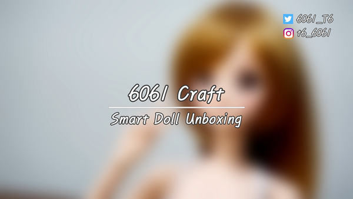{: .align-center}

------

I ordered my Mirai Suenaga Smart Doll on Oct. 26.
I expected it would come in about 3~4weeks beacuse that's what is written.
Smart Doll team has smalll stock, and it would takes maximum 2weeks for getting products ready for shipping, and also it could be late beacasue of pandeic.

So, originally I planned to change interior of my room for fitting my life style to Mirai befroe she comes.
Like throwing about unnecessary one, or making some chairs or a swing for her, and setting lighting device for photo of her.

But, contrary to my planning, Smart Doll just had been already for shipping right day after I ordered (Oct. 27) and, it just arrived 2 days later after shipping.
So it takes only 3 days for I get my Mirai.

It's completely different from what you said Danny....;;;;

Maybe Smart Doll team had some stock of Mirai model, and because I live in South Korea which is quite close to Japn, it could have been fast to arrive.

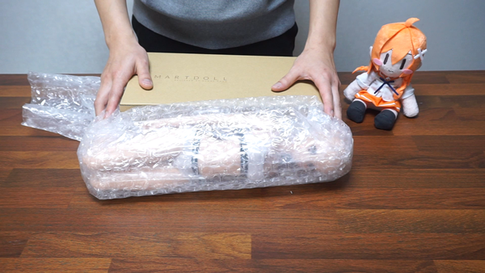

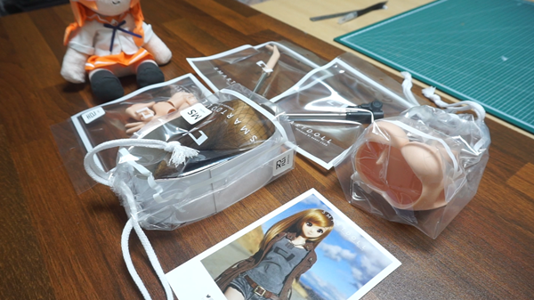

### ~Order List

-Smart Doll (Mirai)
-Option Hand Pack 1
-Medium Smooth Bust Opotion
-Swingy Clickety-Click Stand

------

I knew this but, still it think warping doll with plastic wrapper isn't that good idea
My first BJD(Ball Jointed Doll) was Jasmine(Blue Fairy) and, when I got that it's also wrapped with white cushion.
It just made me feel that Jasmine is real kind of fairy.
I saw that Danny also empahsize that thier doll is completely hand-carfted and that's why I think just plastic wrapper isn't that good enough to get his customers impressed.
At least I want him to wrap her additional cotton or canvas fabric.
Anyway it's 500$ doll.

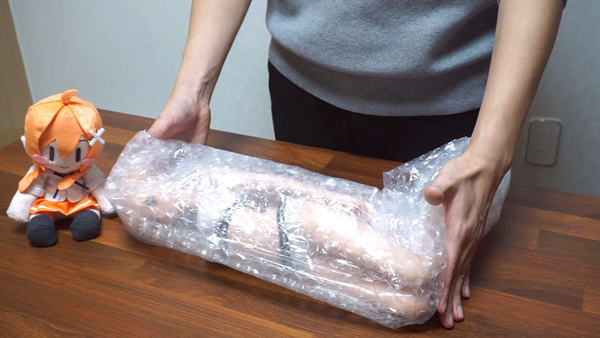

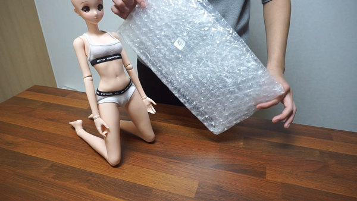

when I rotate her joints, I can feel it really sturdy which means I really love.
I don't know how other BJDs' joints feel like, but I really like Smart Doll's strudy joint.

When I bought BJD first time, there was only tension band type, so make a pose of doll was quite difficult.
But this kind of mechanical joint type can give more freedom to user to make a pose.

I overally like the joints but, one thing I want more is double joint of legs.
Actually it has double joints to arms, but not to legs.
So, relatively less DoF(Degree of Freedom) to legs has more limitation than other dolls.

Obitsu doll has double joints to their legs, and it also can pose "Ahiru-Suwari"
I hope Smart Doll also would provide optional parts of that kind of thing in future days.

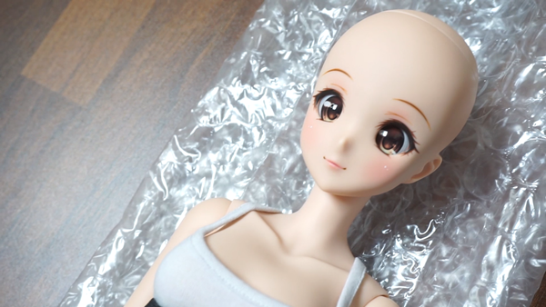

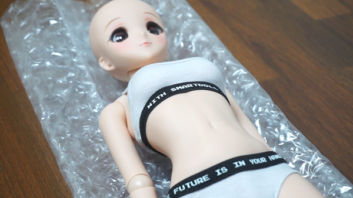

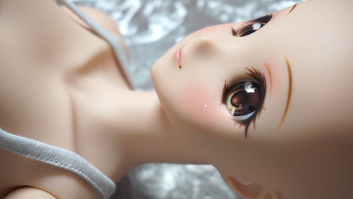

Nothing much I can say about face, body and also inner wear.

It just has perfect quality...
Where is a imperfection they said on Smart Doll pages...?
I get really impressed by her her eyes, face painting, and also delicately sewed inner ware

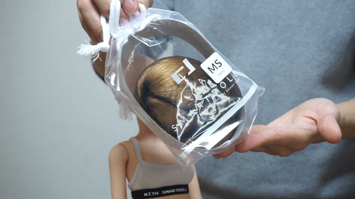

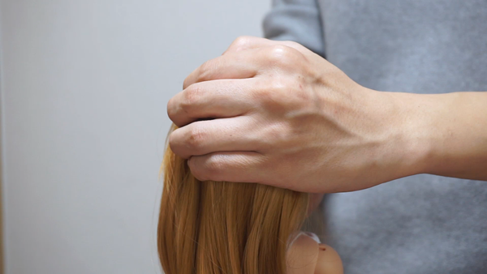

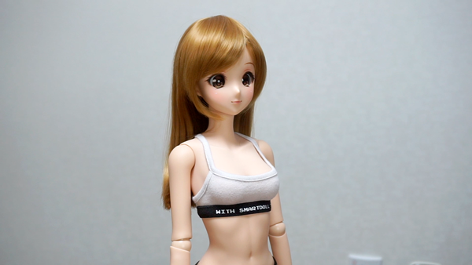

I didn't really much worry about putting wig on, but it was quite different from what I thought.
I've also used several wigs to doll, and even made and cut with my doll, 
but, this wig was too tight for putting on for me.
It takes like 10 mins to do and feeling like

*Am I actually struggling with putting wig on ...?*

But it nicely fit once it is put on.

Nice wavy hair,
Decent wefting arrangement.

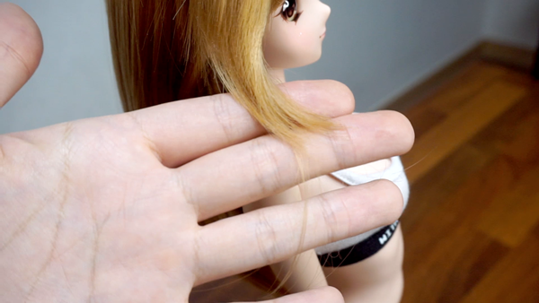

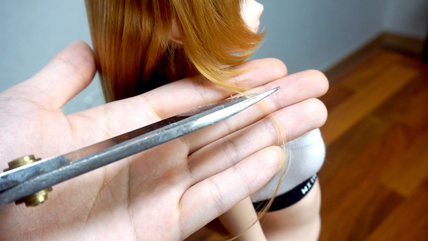

Some of hairs had missed cutting, but I satisfy overally.

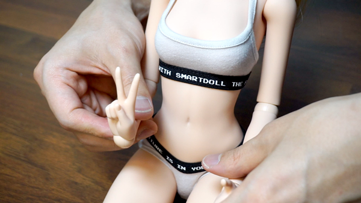

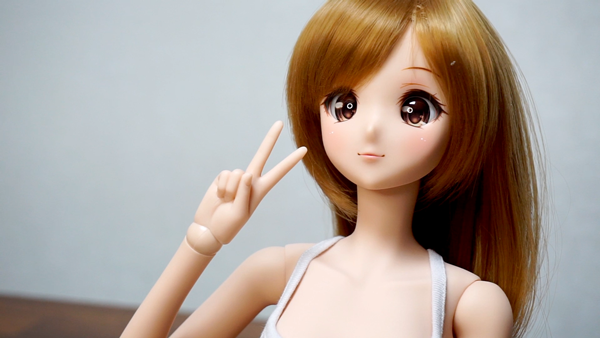

  ☆ V (O_O)

So cute :)

It has been a year since I bought my last doll.
This is my third one and also the most expenseive one ever I bought.
Simply, that cute Mirai's face is still enought for me to buy, but I had still many other options.
DD, Irist Connect.....
But critical thing which let me make my decision was the story of Smart Doll.
How Danny Choo make his company and start to make Doll with 3D printer even though he know nothing much about that.
It was really maker's mind.

Whenever I see Mirai, she reminds me that passion of maker.
As always, I really satisfy with my choice for Smart Doll, and can barely wait for making her clothes.

Next posting would be making torso of her....
